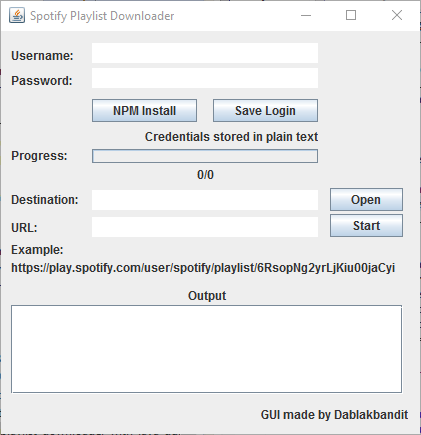

# Spotify Playlist Downloader With Java GUI

Download an entire spotify playlist (160kbps mp3's) to your local machine with a simple interface

When it starts downloading it checks if you already downloaded the song if so it skips it.
When done downloading it also writes the ID3 data and album art to the file.

###To install:
Install nodejs (USE INSTALLER!! Install 64bit if you're on a 64bit system!!!) if you haven't already. ([NodeJS Downloads](https://nodejs.org/en/download/))  

Then download this repository ([HERE](https://github.com/dekiller82/spotify-playlist-downloader-with-windows-gui/archive/master.zip)) or use the button on github. 

Unpack the repository and run the .jar (source code included)

###First Time Setup (Only needs to be done right after downloading)

**I recommend using a brand new Spotify Account for this tool!**

Step 1: Enter Spotify Login Credentials (WARNING CREDENTIALS ARE STORED IN PLAIN TEXT)

Step 2: Click the "NPM Install" button and wait for it say Node Install Finished

###How To Get Playlist URL

Go to the Spotify Webplayer and Navigate to the Playlist you want to download.
Your URL should look something like this:

https://play.spotify.com/user/spotify/playlist/6RsopNg2yrLjKiu00jaCyi

Paste that in to the Spotify Playlist URL Textbox

###Additional Comments

To download Albums for now the only way to do it is to add the songs to a playlist and then download that playlist.

Free Accounts get limited after a while though, but starts downloading again afterwards

You can't login with Facebook accounts so you will have to create a new Spotify user to login.

#####Thanks to /u/dva010/

If you are trying to download an artist that has a '.' at the end of their name, it will create a folder that Windows will not allow you to delete without running a command in cmd.

Pasted command below on how to remove the folder if you guys run into this issue.

Command to delete folder that ends in '.'

rd /s "\?\C:\Documents and Settings\User\Desktop\Annoying Folder."

### Disclaimer:

- This was done purely as an academic exercise.
- I do not recommend you doing this as it may be illegal and/or against Spotify's terms of service.

